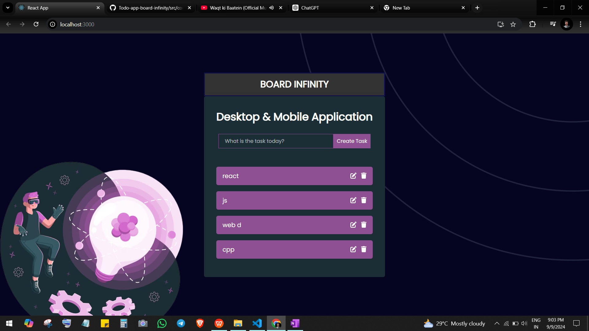

<h1>Created by Farhan Alam</h1>
<h1>Desktop & Mobile Application</h1>
<h3>
Install Node.js and create a new React app using:

npx create-react-app todo-app
cd todo-app
npm start
Modify the project structure:

Open src/App.js.
Implement state management:

Use useState to handle the todo list and input field.
Create functionality for:

Adding new todos.
Deleting todos.
Marking todos as completed.
Build the UI with JSX:

Input field for adding todos.
List to display todos.
Buttons for deleting and marking todos as done.
Style the app using basic CSS in App.css.
</h3>

<h1> Thank you for giving me your valuable time</h1>

